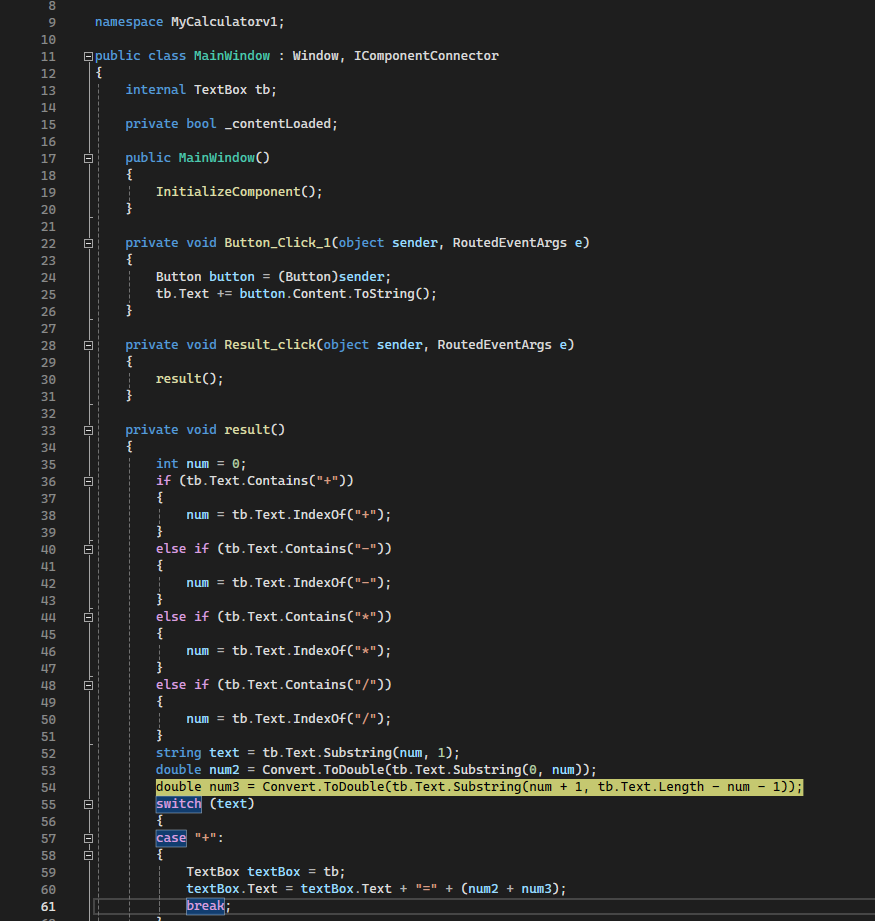

## Task 4 

Description:

We have DumpHomework.zip application which caused an exception and you have a dump file for this exception. Define a place of the error and try to solve it. 

## Results

After investigation of dmp file and decompiling the error we see that error happened on 54 line of MainWindow class. The error was `System.FormatExecption`

    The input string '+++23' was not in a correct format.

To resolve this issue you can add exception handling. Also for other inputs could be added as well as per all operations that could be for example enumerator with mapping that would prevent this kind of errors etc.

